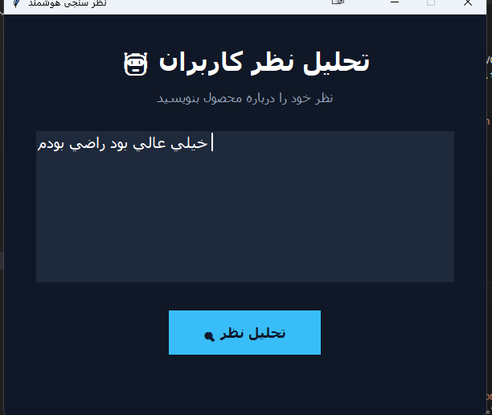
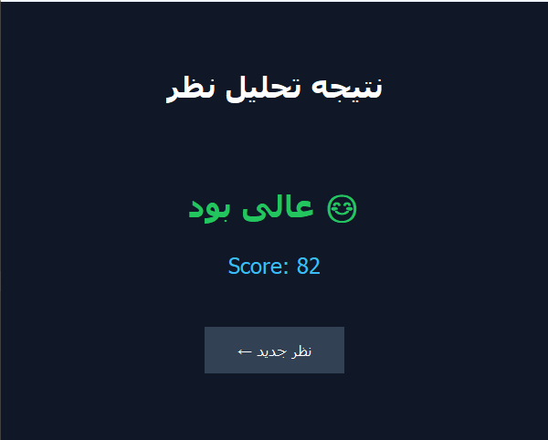

# Persian Review Sentiment Analyzer

A Python machine learning project for analyzing **Persian product reviews** and classifying them into three categories:

- ⭐ **Excellent** — `Suggestion = 1`
- 😐 **Neutral** — `Suggestion = 2`
- 😞 **Bad** — `Suggestion = 3`

The project uses **TF-IDF** for converting Persian text into numerical features and **LinearSVC** for classification. A simple **Tkinter GUI** is included so users can enter a review and see the prediction.

---

## 📌 Project Overview

Online product reviews contain useful information about customer satisfaction. This project uses a dataset of Persian product reviews to train a machine learning model that can understand a written review and classify it.

The application allows the user to:

1. Enter a Persian product review.
2. Analyze the text with the trained machine learning model.
3. Classify the review as excellent, neutral, or bad.
4. Display the predicted category.
5. Display an estimated `Score` related to the predicted category.

---

## ✨ Features

- Persian text classification
- TF-IDF text feature extraction
- Linear Support Vector Machine (`LinearSVC`)
- Simple Tkinter graphical interface
- Separate input and result views
- Displays prediction and score
- CSV dataset support
- Jupyter Notebook for experimentation and training
- Test dataset included
- Easy to understand Python code

---

## 🖥️ Application

The application has two main screens.

### 1. Review Input

The user writes a product review in Persian and clicks the **تحلیل نظر** button.



### 2. Prediction Result

After analyzing the review, the application displays the predicted category and score.



---

## 🤖 Machine Learning

The project uses two main machine learning techniques.

### TF-IDF

`TfidfVectorizer` converts text into numerical features.

It gives higher importance to useful words and lower importance to words that appear frequently across many reviews.

```python
tf = TfidfVectorizer()
x_tf = tf.fit_transform(x)
```

### LinearSVC

`LinearSVC` is used to classify the TF-IDF features.

```python
model = LinearSVC()
model.fit(x_tf, y)
```

For a new review:

```python
model.predict(tf.transform([text]))
```

---

## 🎯 Prediction Classes

The dataset uses the `Suggestion` column as the target.

| Suggestion | Meaning | Application |
|---:|---|---|
| `1` | Positive | عالی بود 😊 |
| `2` | Neutral | بی‌تفاوت 😐 |
| `3` | Negative | افتضاح بود 😞 |

The model predicts the `Suggestion` value from the review text.

---

## 📊 Dataset

The main dataset is:

```text
Dgkala_train.csv
```

It contains Persian product reviews and their labels.

### Dataset columns

| Column | Description |
|---|---|
| `Text` | Persian product review |
| `Score` | Review score |
| `Suggestion` | Classification label |

Example:

| Text | Score | Suggestion |
|---|---:|---:|
| قیمت مناسب ولی صدا خیلی زیاد | 60 | 2 |
| بسیار شیک و با کیفیت | 96 | 1 |
| اصلاراضی نبودم تازه خریدم که تیغه نمی چرخید | 60 | 3 |

---

## 📈 Score

The machine learning model directly predicts the `Suggestion` class.

The `Score` shown in the GUI is calculated from the average `Score` of the reviews belonging to the predicted `Suggestion` class.

For example, if the model predicts:

```text
Suggestion = 1
```

the application calculates the average score of all training samples with:

```text
Suggestion = 1
```

and displays that value.

Therefore, the displayed Score is an **estimated class-based score**, not a separate regression prediction.

---

## 🗂️ Project Structure

```text
.
├── Dgkala.py
├── Dgkala_test.csv
├── Dgkala_train.csv
├── Predict.png
├── README.md
├── Text.png
└── main_dgkala.ipynb
```

---

## 📁 Files

### `Dgkala.py`

The main Python application.

It contains:

- Dataset loading
- TF-IDF vectorization
- LinearSVC training
- Tkinter GUI
- Review prediction
- Result display

Run this file to start the graphical application.

---

### `Dgkala_train.csv`

Training dataset containing Persian reviews, scores, and suggestion labels.

This dataset is used to train the machine learning model.

---

### `Dgkala_test.csv`

Test dataset used for testing and evaluating the project.

---

### `main_dgkala.ipynb`

Jupyter Notebook containing the machine learning development and experiments.

It can be opened with Jupyter Notebook or JupyterLab.

---

### `Text.png`

Screenshot of the application input screen.

It shows where the user enters a Persian review.

---

### `Predict.png`

Screenshot of the prediction result screen.

It shows the predicted category and score.

---

### `README.md`

Project documentation.

---

## 🛠️ Technologies

This project is built with:

- **Python**
- **Pandas**
- **NumPy**
- **Scikit-learn**
- **Tkinter**
- **Jupyter Notebook**
- **TF-IDF**
- **LinearSVC**

---

## 📦 Installation

Make sure Python is installed on your computer.

Install the required libraries:

```bash
pip install pandas numpy scikit-learn
```

`Tkinter` is normally included with standard Python installations.

---

## ▶️ Running the Application

Clone the repository:

```bash
git clone YOUR_REPOSITORY_URL
```

Go to the project folder:

```bash
cd YOUR_REPOSITORY_NAME
```

Run the application:

```bash
python Dgkala.py
```

The graphical interface will open.

---

## 🔍 How It Works

The complete prediction process is:

```text
Persian Review
      ↓
TF-IDF Vectorizer
      ↓
Numerical Text Features
      ↓
LinearSVC Model
      ↓
Suggestion Prediction
      ↓
Score Estimation
      ↓
Result Screen
```

### Example

Input:

```text
خیلی خوب بود و کیفیت بالایی داشت
```

The text is converted into TF-IDF features and passed to the trained LinearSVC model.

The model may return:

```text
Suggestion = 1
```

The application then displays:

```text
عالی بود 😊
```

along with the estimated score.

---

## 🧠 Model Training

The basic training process is:

```python
import pandas as pd
from sklearn.svm import LinearSVC
from sklearn.feature_extraction.text import TfidfVectorizer

data = pd.read_csv("Dgkala_train.csv")

x = data["Text"]
y = data["Suggestion"]

tf = TfidfVectorizer()
x_tf = tf.fit_transform(x)

model = LinearSVC()
model.fit(x_tf, y)
```

For a new review:

```python
text = ["خیلی خوب بود"]

prediction = model.predict(tf.transform(text))

print(prediction)
```

---

## 🖥️ GUI

The graphical interface is created using Tkinter.

The application provides:

- Persian-friendly text input
- Simple dark interface
- Prediction button
- Result page
- Button for entering a new review

The goal is to make the machine learning model easy to use without requiring the user to write Python code.

---

## 📚 What This Project Demonstrates

This project is a practical example of:

- Natural Language Processing (NLP)
- Text classification
- Feature extraction with TF-IDF
- Support Vector Machines
- Working with CSV datasets
- Training a machine learning model
- Using a trained model in a GUI
- Building a simple Python desktop application

---

## 🚀 Possible Future Improvements

Some possible improvements for future versions:

- Better Persian text preprocessing
- Removing Persian stop words
- Persian stemming or lemmatization
- Comparing LinearSVC with other algorithms
- Measuring accuracy, precision, recall, and F1-score
- Showing prediction confidence
- Predicting the exact Score with a regression model
- Improving the graphical interface
- Adding more training data
- Saving and loading the trained model instead of training every time
- Creating a web version of the application

---

## ⚠️ Important Note

The model learns from the reviews available in the training dataset. Its predictions depend on the quality, size, and variety of the dataset.

The `Score` displayed by the application is an estimate based on the average score of the predicted suggestion class. It is not directly predicted by the classification model.

---

## 🎓 Project Purpose

This project was created as a practical machine learning project to demonstrate how Persian text can be processed and classified using Python and Scikit-learn.

It combines:

**Dataset → NLP → Machine Learning → Prediction → GUI**

into one simple application.

---

## 👨‍💻 Author

**Amironix785**

If you find this project useful, feel free to ⭐ the repository.
